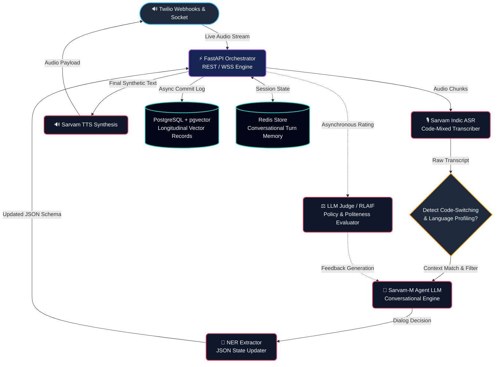

<div align="center">
  <!--  -->
  
  <br/>
  <h1 align="center">VaakSetu 🔊</h1>
  <p align="center"><strong>AI-Powered Multilingual Conversational Intelligence Platform</strong></p>

  <p align="center">
    
    
    
    
    
  </p>
</div>

<br/>

### 🔥 Vision

<hr/>

**VaakSetu** is not just an autonomous voice agent — it is an intelligent, multilingual bridge between grassroots workers and digital ecosystems, designed to eliminate manual data entry and language barriers at scale. Traditional bots falter when encountering the rich tapestry of Indian dialects and mixed languages. VaakSetu leverages advanced Indic-ASR (Sarvam AI) and cutting-edge Language Models to flawlessly comprehend code-mixed conversations (such as Hinglish and Kanglish) in real time — extracting structured data seamlessly while communicating empathetically and intelligently.

<br/>

### ⚡ Key Highlights

<hr/>

- 🗣️ **Native Code-Mixed Handling:** Treats *Hinglish* and *Kanglish* as first-class languages using 12,000+ hour trained Indic models.
- 🧠 **RLAIF Self-Improvement Loop:** Driven by Direct Preference Optimization (DPO). The system leverages an LLM Judge to score conversations and continuously self-align without human annotation.
- 🔄 **Zero-Retrain Domain Switching:** Transition identically from *Healthcare (ASHA)* to *Financial Services (NBFC)* by simply swapping a declarative YAML configuration file.
- 📞 **Voice-First Automation:** Fully integrated Twilio architectural stack capable of simultaneous bulk outbound emergency routing and automated inbound support workflows.

<br/>

### 🏗️ System Architecture

<hr/>

VaakSetu is built on a highly scalable, fail-safe microservice architecture designed for real-time inference handling:



<br/>

### 📂 Repository Structure

<hr/>

The codebase components map elegantly to the pipeline described above:

```text
MultilinguaIIITD/
├── 📁 task1_ai_core/          # Core Language Model logic, Memory, ASR wrappers & RLAIF Judge
├── 📁 task2_backend/          # FastAPI entrypoint, Routes, WebSocket handlers & PostgreSQL models
├── 📁 task3_frontend/         # Vite/React App, Visualizations, API layer, CSS Custom Themes
├── 📁 task4_output_layer/     # Twilio tele-automation SDKs and Server push strategies
├── 📁 configs/                # Domain-specific routing and system YAMLs (Healthcare / Financial)
├── 📝 .env                    # Unified Centralized Secrets & Configuration
├── 📝 docker-compose.yml      # Container definitions for DB and Redis
└── 📝 requirements.txt        # Universal unified project dependencies
```

<br/>

### 🚀 Quick Start Guide

<hr/>

**Prerequisites:** You will need Python 3.10+, Node.js 18+, and Docker installed on your host machine.

#### 1. Setup Data Services
The system depends on PostgreSQL (relational & vector storage) and Redis (memory):
```bash
docker-compose up -d
```

#### 2. Start Backend Orchestrator
To run the primary FastAPI orchestrator and connect the intelligence pipes:
```bash
python -m venv --system-site-packages venv
source venv/bin/activate  # Or .\venv\Scripts\Activate.ps1 on Windows
pip install -r requirements.txt

# Start the uvicorn worker
python -m uvicorn task2_backend.main:app --host 0.0.0.0 --port 8000 --reload
```

#### 3. Start Visual UI & Dashboards
Launch the premium Vite/React-driven frontend to view Live Transcripts and the RLAIF Scorecard:
```bash
cd task3_frontend
npm install
npm run dev -- --port 3000
```
> Navigate to `http://localhost:3000` to interact with the VaakSetu visual layer.

<br/>

<div align="center">
  <p><i>Engineered for the future of multilingual operations by Team Agnishakti.</i></p>
</div>