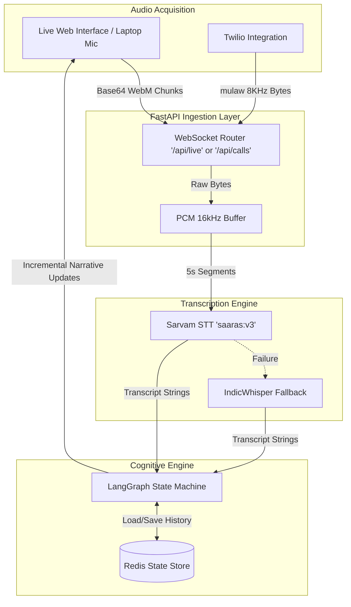
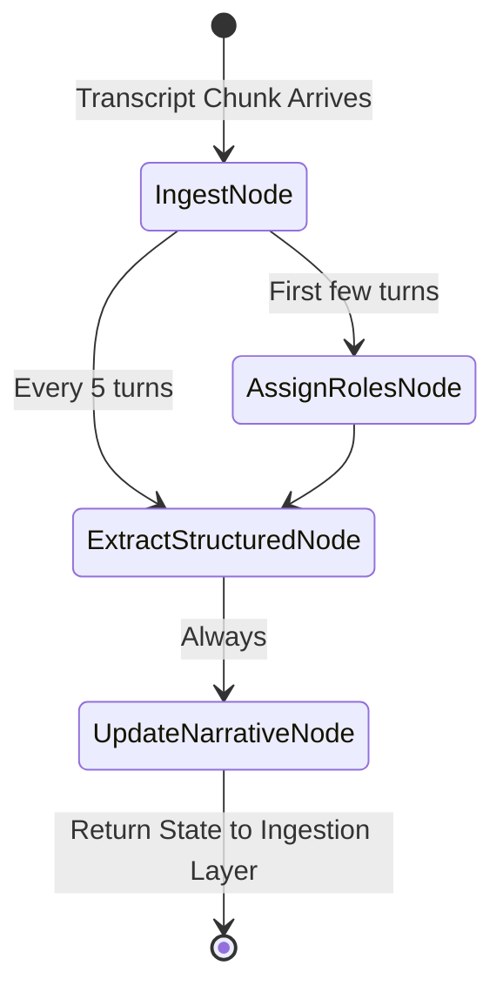

# Real-Time Call Summarisation Architecture

This document breaks down the technical architecture, design patterns, and services behind the VaakSetu Real-Time Call Summarisation framework.

## 1. High-Level Architecture Overview

VaakSetu operates as a **streaming pipeline**. Instead of waiting for a call to end and then feeding the entire transcript to a single LLM prompt (which suffers from latency and context window limitations), the system continuously ingests small audio chunks, transcribes them in near real-time, and feeds them into a stateful graph agent.



---

## 2. Audio Ingestion & Buffer Strategy

### Why Buffer?
Transcribing single words or 1-second chunks is computationally inefficient and leads to poor accuracy, as the STT models lose linguistic context. 

### Implementation:
We capture continuous audio but intentionally hold it in a `bytearray` or temporary file until roughly **5 seconds** of audio has accumulated. 

- **Browser Audio:** Sent via `MediaRecorder` every 5,000 milliseconds.
- **Twilio Audio:** Mulaw bytes stream continuously; we count bytes until `TWILIO_SAMPLE_RATE * 5` is reached, decode via `audioop`, upsample to 16kHz, and process.

---

## 3. The LangGraph State Machine (Cognitive Engine)

The core intelligence is powered by **LangGraph**, which allows us to treat language model interactions like a cyclic graph where state persists between turns.

### The Problem with Monolithic Architecture
In a standard chat agent approach, generating a summary means sending `[Turn 1, Turn 2, ..., Turn N]` to an LLM. As a 20-minute call grows to hundreds of turns, token limits are exhausted, and generation time spikes to 20-30 seconds.

### The LangGraph Solution
We maintain a `ConversationState` dictionary representing the "brain" of the call. It holds a rolling window of recent transcripts, mapping extracted entities, and the running English summary. 



**Node Breakdown:**
1. **Ingest Node**: Appends the raw string securely into history and increments the `turn_count`.
2. **Assign Roles Node**: A lightweight LLM call that looks at early dialogue and maps arbitrary tags to real-world roles (e.g., `SPEAKER_00` -> Doctor).
3. **Extract Structured Node**: Leverages Pydantic constraints and Sarvam-M's reasoning tokens (`<think>`) to extract strict JSON parameters mapped dynamically from `./configs/*.yaml`.
4. **Update Narrative Node**: Reads the *current* running narrative, looks at the *newly added* 5 turns of conversation, and updates the narrative to reflect the new state. This avoids reprocessing the first 10 minutes of a call when we are currently at minute 11.

---

## 4. Multi-Modal Interfaces (How we get data)

Regardless of the audio source, the backend expects the logic to normalize into standard text chunks. We support two primary ingest pipes:

### Local React/HTML Environment
A native JavaScript `MediaRecorder` hook captures the laptop microphone. We use WebSockets to push `audio/webm;codecs=opus` chunks directly to the backend bypassing heavy HTTP overhead.

### Twilio Telecom Media Streams
An outbound `POST` request triggers Twilio to make a traditional cellular call. We attach a TwiML `<Start><Stream>` command that initiates a bidirectional WebSocket. The payload is `audio/x-mulaw` encoded. 

To bridge this to our AI models, the server performs a live topological conversion:
```python
# Decode mulaw to 16-bit PCM at 8kHz
pcm_8k = audioop.ulaw2lin(mulaw_bytes, 2)
# Upsample 8kHz -> 16kHz for ASR readiness
pcm_16k, _ = audioop.ratecv(pcm_8k, 2, 1, 8000, 16000, None)
```

---

## 5. Technology Stack Summary

| Technology | Purpose | Location |
|------------|---------|----------|
| **FastAPI** | High-performance async API server | `task2_backend/main.py` |
| **WebSockets** | Zero-latency duplex communication | `routes_live_mic.py`, `routes_twilio_media.py` |
| **LangGraph** | Cyclic state execution | `task1_ai_core/graph_agent.py` |
| **Pydantic V2** | Type-safe JSON structuring for models | `task2_backend/domain_config.py` |
| **Sarvam AI APIs** | Foundation logic and transcription | `task1_ai_core/asr.py` |
| **Hugging Face** | AI4Bharat IndicWhisper Fallback (`token` authed) | `task1_ai_core/asr.py` |

By transitioning from REST batch-processing to **WebSocket Streaming + LangGraph Incremental Appending**, VaakSetu now scales linearly without context degradation over long calls.
