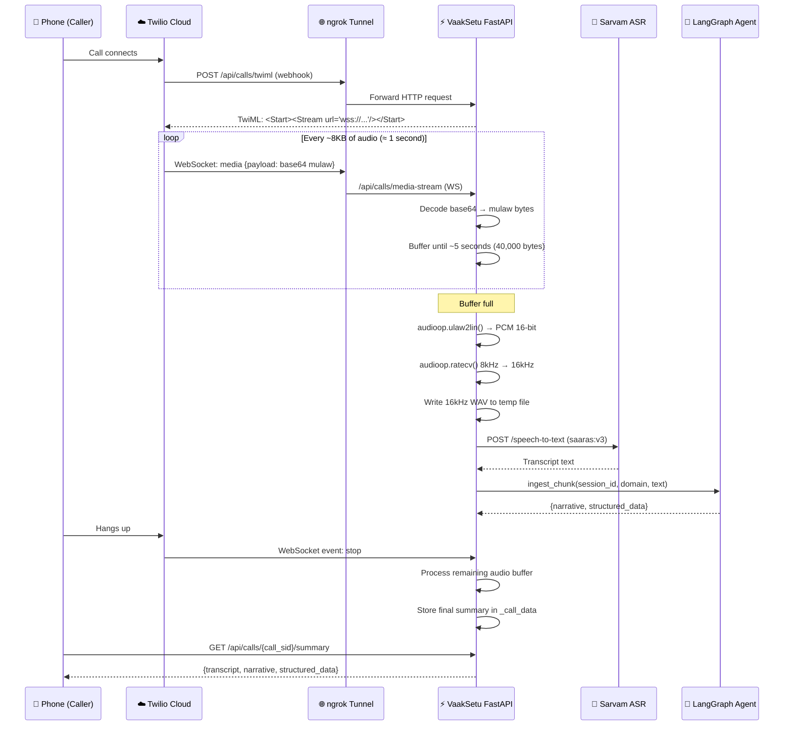

# Twilio Media Streams — VaakSetu Integration Guide

> **Sources:** [Twilio Media Streams Overview](https://www.twilio.com/docs/voice/media-streams) · [WebSocket Messages Reference](https://www.twilio.com/docs/voice/media-streams/websocket-messages)

This guide explains **how to connect a real Twilio phone call to VaakSetu** so that the live call audio is transcribed by Sarvam ASR and summarised in real-time by the LangGraph agent.

---

## How It Works — End-to-End



---

## Key Concepts from Twilio Docs

### WebSocket Message Types (Twilio → Your Server)

| Event | When Sent | Key Fields |
|-------|-----------|------------|
| `connected` | WebSocket handshake complete | `protocol`, `version` |
| `start` | First message after connect | `callSid`, `streamSid`, `mediaFormat` |
| `media` | **Continuously during call** | `media.payload` (base64 mulaw audio) |
| `dtmf` | User presses keypad | `dtmf.digit` |
| `stop` | Call ended | `stop.callSid` |
| `mark` | Bidirectional: playback complete | `mark.name` |

### Audio Format
- **Encoding:** `audio/x-mulaw` (G.711 u-law)
- **Sample Rate:** `8000 Hz` (always)
- **Channels:** `1` (mono, always)
- **Payload:** base64-encoded raw bytes (no WAV header)

### Two Stream Modes

| Mode | TwiML Verb | Audio Direction | Use Case |
|------|-----------|-----------------|----------|
| Unidirectional | `<Start><Stream>` | Twilio → Your Server | Listen only (summarisation) |
| Bidirectional | `<Connect><Stream>` | Both ways | AI voice assistant, IVR |

VaakSetu uses **unidirectional** streams for call summarisation.

---

## Step-by-Step Setup

### Step 1: Create a Twilio Account & Get a Phone Number

1. Go to [https://www.twilio.com/try-twilio](https://www.twilio.com/try-twilio) and sign up.
2. Navigate to **Phone Numbers → Manage → Buy a number**.
3. Search for an Indian number (`+91`) or US number; select one with **Voice** capability.
4. Note your number (e.g., `+12345678900`).

> [!IMPORTANT]
> **Trial accounts** can only call **verified** numbers. Go to **Verified Caller IDs** and add the destination phone number before testing.

---

### Step 2: Get Your Credentials

In the [Twilio Console](https://console.twilio.com/):
- **Account SID** — starts with `AC...`
- **Auth Token** — found on the dashboard
- **Phone Number** — the number you bought

Set these in your `.env`:
```env
TWILIO_ACCOUNT_SID=ACxxxxxxxxxxxxxxxxxxxxxxxxxxxxxxxx
TWILIO_AUTH_TOKEN=your_auth_token_here
TWILIO_PHONE_NUMBER=+12345678900
```

---

### Step 3: Expose Your Local Server with ngrok

Twilio must reach your backend over the **public internet**. ngrok creates a secure tunnel from a public HTTPS URL to your local server.

**Option A: Docker (Recommended)**
```powershell
# Set your ngrok auth token in .env
NGROK_AUTHTOKEN=your_ngrok_token_here

# Start ngrok via docker-compose
docker-compose up -d ngrok
```

Get the public URL:
```powershell
# Check ngrok dashboard
Start-Process "http://localhost:4040"
```

Copy the URL (e.g., `https://abcd-1234.ngrok-free.app`) and set:
```env
PUBLIC_BASE_URL=https://abcd-1234.ngrok-free.app
```

**Option B: Direct ngrok**
```powershell
# Install
winget install ngrok

# Authenticate
ngrok config add-authtoken your_ngrok_token

# Start tunnel
ngrok http 8000
```

> [!WARNING]
> The ngrok URL changes on every restart (free plan). You **must** update `PUBLIC_BASE_URL` in `.env` and restart the FastAPI server each time.

---

### Step 4: Start the Backend

```powershell
uvicorn task2_backend.main:app --port 8000 --reload
```

You should see in logs:
```
✓ Database initialized (SQLite)
✓ Domain configs loaded (financial, healthcare)  
✓ Twilio config validated
✓ Live Conversation UI at http://localhost:8000/live
✓ Backend ready on http://localhost:8000
```

Verify Twilio can reach your webhook:
```powershell
# Test the TwiML endpoint via your public URL
Invoke-WebRequest "$env:PUBLIC_BASE_URL/api/calls/twiml" -Method POST
```
You should get an XML response with `<Response>`.

---

### Step 5: Make the Outbound Call

```powershell
# PowerShell
$body = @{
    to_number = "+917081312283"
    domain    = "healthcare"
} | ConvertTo-Json

Invoke-RestMethod `
    -Uri "http://localhost:8000/api/calls/outbound" `
    -Method POST `
    -ContentType "application/json" `
    -Body $body
```

Or with curl:
```bash
curl -X POST http://localhost:8000/api/calls/outbound \
  -H "Content-Type: application/json" \
  -d '{"to_number": "+917081312283", "domain": "healthcare"}'
```

**Response:**
```json
{
  "status": "ok",
  "call_sid": "CA1234567890abcdef...",
  "message": "Call initiated to +917081312283"
}
```

---

### Step 6: Monitor the Live Stream

Watch the FastAPI logs while the call is active — you'll see:

```
[CA1234...] Call status: initiated
[CA1234...] Media stream connected: MZ98765...
[CA1234...] Receiving audio... buffered 8000/40000 bytes
[CA1234...] Buffered 40000 bytes → transcribing...
[CA1234...] Sarvam ASR: "Hello, I am calling about my appointment..."
[CA1234...] Graph agent updated narrative (turn 1)
[CA1234...] Buffered 40000 bytes → transcribing...
...
[CA1234...] Stream stopped — call ended
[CA1234...] Final summary stored
```

---

### Step 7: Get the Call Summary

After the call ends, wait ~5 seconds, then:

```powershell
# Replace CA... with your actual call SID
Invoke-RestMethod -Uri "http://localhost:8000/api/calls/CA1234567890abcdef/summary"
```

**Response:**
```json
{
  "status": "ok",
  "call_metadata": {
    "call_sid": "CA1234567890abcdef",
    "to": "+917081312283",
    "domain": "healthcare",
    "status": "completed"
  },
  "transcript": [
    "Hello, I am calling about my appointment",
    "The patient reports headache for three days",
    "Doctor recommends paracetamol 500mg twice daily"
  ],
  "narrative": "The call was initiated by a patient reporting a persistent headache over three days. The attending physician, Dr. Sharma, diagnosed the condition as tension headache and prescribed paracetamol 500mg twice daily for five days, with a follow-up in one week.",
  "structured_data": {
    "chief_complaint": "Headache",
    "symptoms": ["headache", "fatigue"],
    "diagnosis": "Tension headache",
    "medications": ["Paracetamol 500mg"],
    "treatment_plan": "500mg twice daily for 5 days",
    "follow_up_date": "1 week"
  },
  "speaker_map": {
    "SPEAKER_00": "Doctor",
    "SPEAKER_01": "Patient"
  }
}
```

---

## Audio Processing Pipeline Detail

```mermaid
graph LR
    A["Twilio WebSocket\nbase64 mulaw/8kHz"] -->|base64.b64decode| B["Raw mulaw bytes"]
    B -->|audioop.ulaw2lin| C["PCM 16-bit\n8kHz mono"]
    C -->|audioop.ratecv\n8000→16000| D["PCM 16-bit\n16kHz mono"]
    D -->|Wave module| E["16kHz WAV file\n(temp)"]
    E -->|Sarvam API\nsaaras:v3| F["Transcript text\n(multilingual)"]
    F -->|WebSocket msg| G["LangGraph\nState Machine"]
    G -->|Incremental| H["Narrative\n+ Structured Data"]
```



### Why mulaw → PCM conversion?

Twilio sends **G.711 µ-law** (telephone standard) at 8kHz. Sarvam ASR expects **16kHz PCM WAV**. The conversion pipeline:

```python
import audioop, wave

# 1. Decode base64
raw_mulaw = base64.b64decode(payload)

# 2. mulaw → 16-bit PCM at 8kHz
pcm_8k = audioop.ulaw2lin(raw_mulaw, 2)  # 2 = 16-bit

# 3. Upsample 8kHz → 16kHz
pcm_16k, _ = audioop.ratecv(pcm_8k, 2, 1, 8000, 16000, None)

# 4. Write WAV
with wave.open(tmp_path, 'wb') as wf:
    wf.setnchannels(1)
    wf.setsampwidth(2)
    wf.setframerate(16000)
    wf.writeframes(pcm_16k)
```

---

## TwiML Response Explained

When Twilio connects the call, it fetches `POST /api/calls/twiml`. VaakSetu responds with:

```xml
<?xml version="1.0" encoding="UTF-8"?>
<Response>
  <Say voice="alice" language="en-IN">
    This call is being recorded and summarised by VaakSetu AI.
  </Say>
  <Start>
    <Stream url="wss://abcd-1234.ngrok-free.app/api/calls/media-stream">
      <Parameter name="callSid" value="CA..."/>
      <Parameter name="domain" value="healthcare"/>
    </Stream>
  </Start>
  <Pause length="60"/>
</Response>
```

- **`<Say>`** — plays a message to the caller
- **`<Start><Stream>`** — unidirectional stream; starts sending audio to your WebSocket
- **`<Pause>`** — keeps the call alive while the stream runs; increase for longer calls

---

## API Reference

| Method | Endpoint | Description |
|--------|----------|-------------|
| `POST` | `/api/calls/outbound` | Initiate an outbound call |
| `POST` | `/api/calls/twiml` | *Twilio webhook* — returns TwiML |
| `POST` | `/api/calls/status` | *Twilio webhook* — call status updates |
| `WS`   | `/api/calls/media-stream` | *Twilio WebSocket* — receives mulaw audio |
| `GET`  | `/api/calls/{call_sid}/summary` | Get final summary after call ends |

---

## Troubleshooting

> [!WARNING]
> **Error 21210 / 21215** — Trial account restriction. You can only call verified numbers. Go to [Twilio Console → Verified Caller IDs](https://console.twilio.com/verified-caller-ids) and add the number.

> [!WARNING]
> **Error 11200 / 11205** — Twilio cannot reach your webhook. Check that: (1) ngrok is running, (2) `PUBLIC_BASE_URL` is set correctly, (3) the FastAPI server is running on port 8000.

> [!WARNING]
> **WebSocket closes immediately** — The path `/api/calls/media-stream` must exactly match what's in your TwiML `<Stream url=...>`. Check `routes_twilio_media.py`.

> [!TIP]
> **Monitor ngrok requests** at [http://localhost:4040](http://localhost:4040) to see exactly what Twilio is sending to your webhook.

> [!TIP]
> **Empty transcript** — Check `SARVAM_API_KEY` is valid. Test it with `curl -X POST http://localhost:8000/api/transcribe -F audio=@test.wav` and confirm you get a transcript back.

> [!TIP]
> **Longer calls** — Increase `<Pause length="60"/>` to `<Pause length="300"/>` in `routes_calls.py` for 5-minute calls. Each `<Pause>` keeps the call alive that many seconds.

---

## Security: Validating Twilio Requests

For **production**, validate every webhook is genuinely from Twilio using the `X-Twilio-Signature` header:

```python
from twilio.request_validator import RequestValidator
from task1_ai_core.twilio_config import TWILIO_AUTH_TOKEN

validator = RequestValidator(TWILIO_AUTH_TOKEN)

def verify_twilio_request(url: str, params: dict, signature: str) -> bool:
    return validator.validate(url, params, signature)
```

Add this validation to `routes_calls.py` before processing any Twilio webhook.

---

## Production Checklist

- [ ] Replace ngrok with a fixed domain (e.g., Railway, Render, or your own VPS)
- [ ] Set `PUBLIC_BASE_URL` to your permanent domain in `.env`
- [ ] Add `X-Twilio-Signature` validation to all webhook routes
- [ ] Move `_call_registry` from in-memory dict to Redis
- [ ] Set `<Pause length="600"/>` for long calls (10 min max per TwiML instruction)
- [ ] Enable call recording in Twilio Console for backup
- [ ] Buy a production Twilio number (non-trial) to call any number freely
